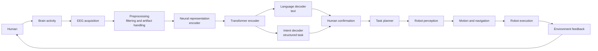
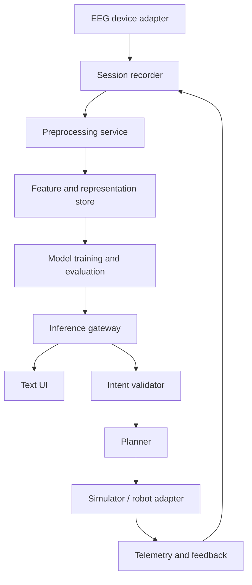

# NeuroLink

## EEG-to-Text and Brain-to-Robot Intelligence Platform

<p align="center">
  <svg width="760" height="190" viewBox="0 0 760 190" role="img" aria-label="NeuroLink pipeline from EEG to robot action">
    <defs>
      <linearGradient id="flow" x1="0" x2="1">
        <stop offset="0" stop-color="#16B8A6"/>
        <stop offset="1" stop-color="#FFB547"/>
      </linearGradient>
      <filter id="shadow"><feDropShadow dx="0" dy="5" stdDeviation="6" flood-opacity=".18"/></filter>
    </defs>
    <rect width="760" height="190" rx="24" fill="#102A43"/>
    <path d="M110 95h540" stroke="url(#flow)" stroke-width="8" stroke-linecap="round"/>
    <g filter="url(#shadow)" font-family="Segoe UI,Arial,sans-serif" text-anchor="middle">
      <g><circle cx="90" cy="95" r="40" fill="#16B8A6"/><text x="90" y="91" fill="white" font-size="15" font-weight="700">EEG</text><text x="90" y="109" fill="white" font-size="11">signal</text></g>
      <g><circle cx="250" cy="95" r="40" fill="#2D9CDB"/><text x="250" y="91" fill="white" font-size="13" font-weight="700">DECODE</text><text x="250" y="109" fill="white" font-size="11">representation</text></g>
      <g><circle cx="410" cy="95" r="40" fill="#8C6FF0"/><text x="410" y="91" fill="white" font-size="13" font-weight="700">INTENT</text><text x="410" y="109" fill="white" font-size="11">text or task</text></g>
      <g><circle cx="570" cy="95" r="40" fill="#FFB547"/><text x="570" y="91" fill="#102A43" font-size="13" font-weight="700">PLAN</text><text x="570" y="109" fill="#102A43" font-size="11">robot action</text></g>
      <g><circle cx="690" cy="95" r="28" fill="#F26B5E"/><text x="690" y="99" fill="white" font-size="12" font-weight="700">ACT</text></g>
    </g>
  </svg>
</p>

> **Research prototype to closed-loop brain-computer interface.** NeuroLink investigates how non-invasive EEG can become reliable language, semantic intent, and safe robot action.

[](#roadmap) [](#scope) [](#)

## 1. Product North Star

NeuroLink will progressively translate brain activity into useful communication and executable robotic intent:

```text
EEG -> signal processing -> neural representation -> language / intent
    -> text or robot task -> planning -> perception -> motion -> feedback
```

The product is an experimental platform for measurable research, not a claim of unrestricted mind reading. Every stage must expose uncertainty, support human confirmation, and remain reversible.

## 2. Scope

| Track                   | Example output       | Difficulty | Initial role                   |
| ----------------------- | -------------------- | :--------: | ------------------------------ |
| **EEG classification**  | LEFT, RIGHT, YES, NO |    Low     | Baseline and calibration       |
| **EEG-to-language**     | “I want water”       |    High    | Research milestone             |
| **EEG-to-robot intent** | `FETCH(WATER)`       |    High    | Primary long-term product path |

Imagined speech is scientifically challenging because non-invasive EEG has low signal-to-noise ratio, strong subject variability, and context-dependent neural patterns. The platform therefore prioritizes constrained tasks and semantic commands before open-ended text generation.

## 3. System Model



### Command contract

| Layer         | Example                         | Required properties             |
| ------------- | ------------------------------- | ------------------------------- |
| Neural output | confidence distribution         | calibrated, timestamped         |
| Intent        | `FETCH`                         | closed vocabulary, confidence   |
| Parameters    | `object: WATER`                 | validated against scene/context |
| Plan          | navigate, locate, grasp, return | inspectable and interruptible   |
| Execution     | robot trajectory                | bounded, monitored, cancellable |

## 4. Product Principles

- **Constrained before open-ended:** earn complexity through validated baselines.
- **Intent before prose:** structured robot tasks are more realistic than unrestricted EEG-to-sentence decoding.
- **Human in the loop:** uncertain commands require confirmation rather than silent execution.
- **Closed-loop by design:** perception and environment feedback are part of the intelligence system.
- **Reproducible science:** version datasets, subjects, preprocessing, models, metrics, and experiments.
- **Safety first:** no physical action without authorization, confidence gates, and an emergency stop path.

## 5. Research Workstreams

| Workstream              | Questions                                           | Prototype deliverable                        |
| ----------------------- | --------------------------------------------------- | -------------------------------------------- |
| Acquisition             | Can recordings be synchronized and quality-scored?  | EEG ingestion and session metadata           |
| Signal processing       | Which filters and artifact controls generalize?     | Reproducible preprocessing pipeline          |
| Representation learning | Can subject-aware embeddings separate task signals? | Encoder baseline and embedding reports       |
| Decoding                | Which model and windowing strategy works best?      | Classifier, language decoder, intent decoder |
| Robotics                | Can commands be grounded safely in a scene?         | Simulator-first planner and robot adapter    |
| Evaluation              | Does performance survive new sessions and users?    | Benchmark harness and experiment registry    |

## 6. Milestones and Exit Criteria

| Phase | Focus           | Exit criteria                                                               |
| :---: | --------------- | --------------------------------------------------------------------------- |
| **0** | Instrumentation | Timestamped EEG sessions, data dictionary, quality checks                   |
| **1** | Classification  | Held-out-session baseline for LEFT/RIGHT/YES/NO; confusion matrix published |
| **2** | Robust decoding | Subject-independent evaluation, calibration, and ablation report            |
| **3** | Semantic intent | Closed-vocabulary commands with parameter validation and confirmation UI    |
| **4** | Simulated robot | Planner executes approved tasks in a deterministic simulator                |
| **5** | Physical pilot  | Low-risk, supervised tasks with emergency stop and event logs               |

## 7. Evaluation Framework

| Dimension      | Representative measures                                        |
| -------------- | -------------------------------------------------------------- |
| Signal quality | channel dropout rate, artifact ratio, usable-window percentage |
| Classification | accuracy, macro-F1, balanced accuracy, confusion matrix        |
| Generalization | cross-session and leave-one-subject-out performance            |
| Calibration    | expected calibration error, abstention quality                 |
| Language       | word error rate, semantic similarity, intent accuracy          |
| Robotics       | task completion, intervention rate, collision-free execution   |
| Human factors  | confirmation time, cognitive load, false activation rate       |

Every result should report subject count, session split, preprocessing, confidence intervals where possible, and a comparison with a non-EEG baseline.

## 8. Safety and Ethics

NeuroLink must remain a research system with explicit consent, privacy controls, and supervised operation. EEG data is sensitive biometric information: access must be controlled, identifiers minimized, and retention documented. The system must be able to abstain, explain its confidence, request confirmation, and stop robot motion immediately. No medical diagnosis, coercive use, or unsupervised high-risk actuation is in scope.

## 9. Prototype Architecture



| Component | Prototype choice                            | Boundary                            |
| --------- | ------------------------------------------- | ----------------------------------- |
| Data      | versioned local sessions plus metadata      | raw EEG never silently overwritten  |
| Models    | Python research modules, Transformer-ready  | training separated from execution   |
| Interface | text and structured intent views            | confidence and confirmation visible |
| Robotics  | simulator first, adapter second             | hardware actions gated and logged   |
| Quality   | pre-commit, secret scan, experiment reports | reproducible before scale           |

## 10. Open Research Questions

1. Which EEG montage, sampling rate, and task protocol give the strongest signal?
2. How much personalization is needed before transfer learning becomes useful?
3. Can uncertainty calibration reliably trigger abstention?
4. Which semantic command vocabulary is expressive enough for useful robot tasks while remaining learnable?
5. How should environmental feedback update decoding without creating unsafe feedback loops?

## 11. Definition of Done

A milestone is complete only when the implementation, dataset version, configuration, evaluation report, failure cases, and safety behavior are documented and reproducible by another researcher.

---

**Status:** Research specification
**Product name:** NeuroLink
**Next practical step:** establish the EEG classification baseline and its reproducible session protocol.
