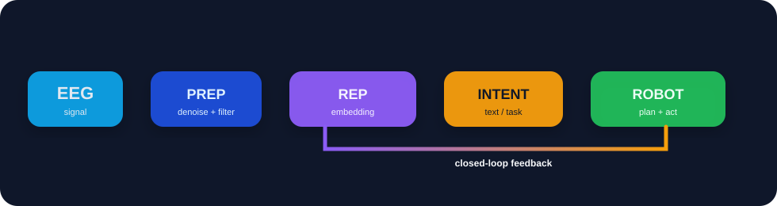
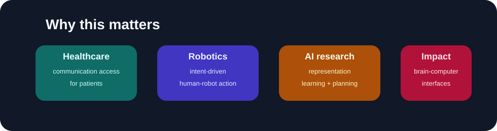
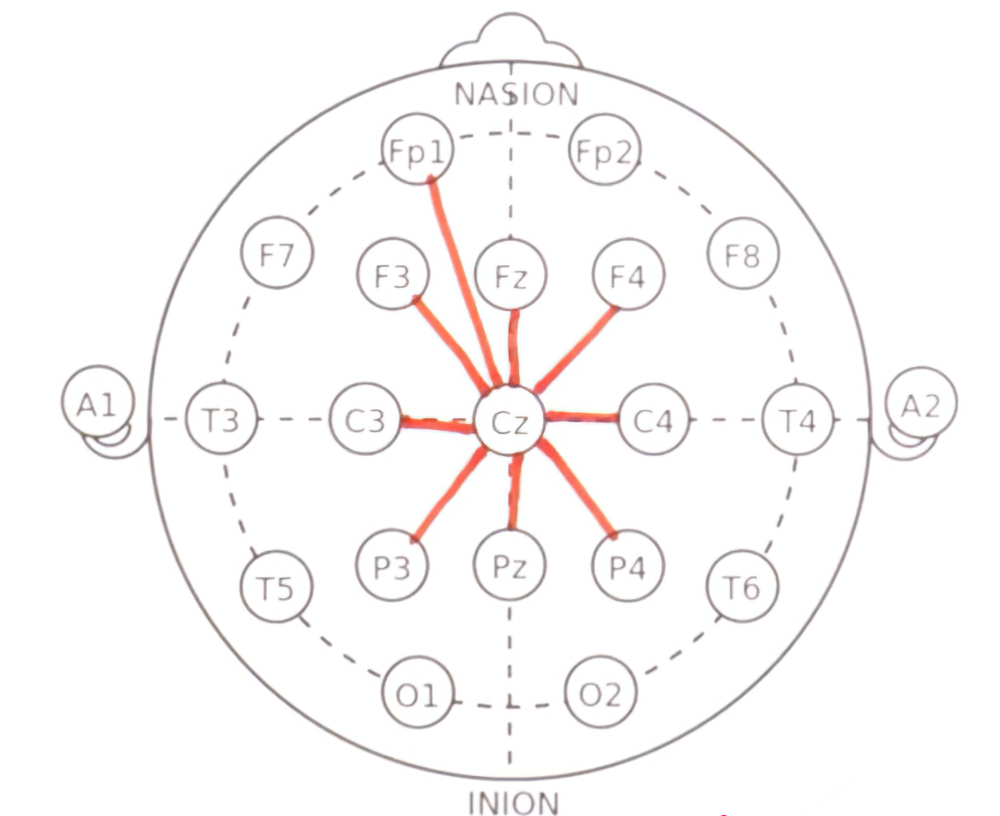
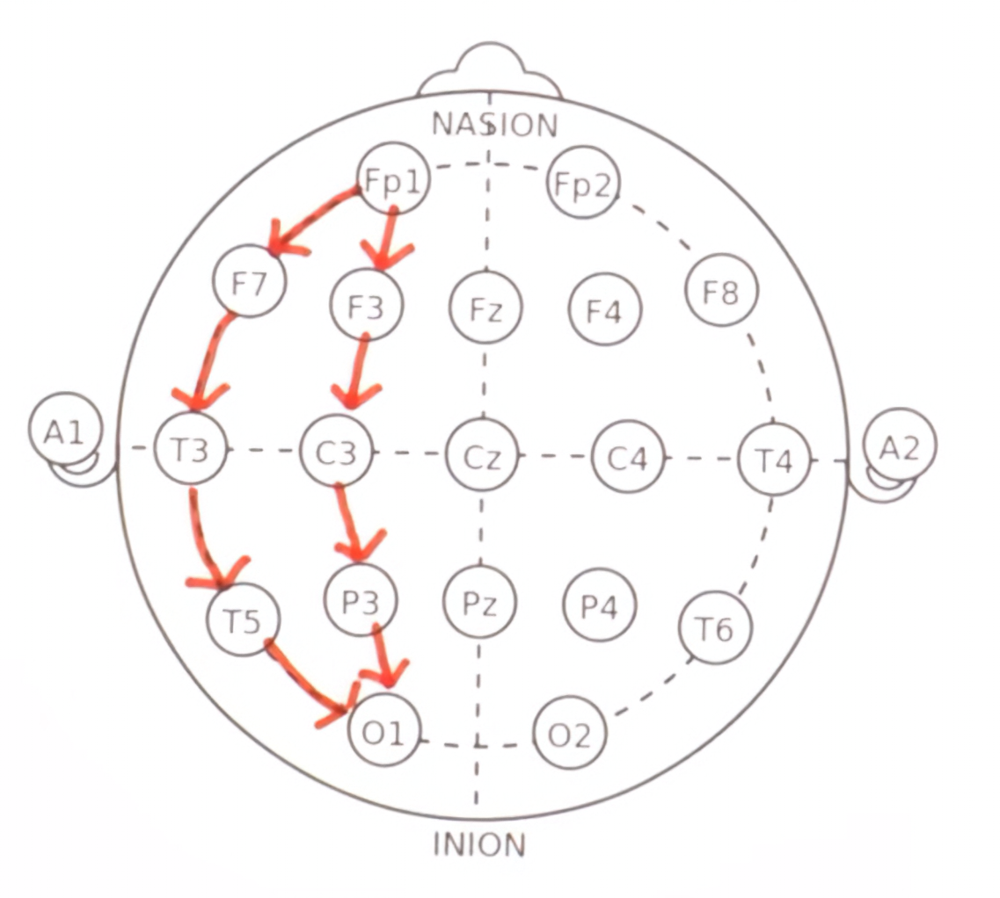

# NeuroLink

## EEG-to-Text and Brain-to-Robot Intelligence Platform

<p align="center">
  
</p>

**EEG → neural representations → language and intent → safe robot action**

NeuroLink is a research platform exploring how non-invasive EEG can be decoded into constrained language, semantic intent, and eventually closed-loop robotic behavior. It starts with measurable EEG classification and advances toward simulator-first brain-to-robot interaction.

## Why this project matters

<p align="center">
  
</p>

| Domain                     | Why it matters                                                                    |
| -------------------------- | --------------------------------------------------------------------------------- |
| Healthcare                 | Enables more natural communication pathways for patients and accessibility tools. |
| Robotics                   | Lets a human communicate intent without heavy manual control interfaces.          |
| AI research                | Pushes representation learning, multimodal reasoning, and temporal decoding.      |
| Human-computer interaction | Explores how brains and machines can cooperate under uncertainty and feedback.    |

## Product direction

| Track               | Near-term outcome                                   | Difficulty |
| ------------------- | --------------------------------------------------- | ---------- |
| EEG classification  | LEFT, RIGHT, YES, NO baselines                      | Low        |
| EEG-to-language     | Research decoding of speech-related representations | High       |
| EEG-to-robot intent | Validated commands such as `FETCH(WATER)`           | High       |

The project prioritizes structured intent over unrestricted mind-reading claims. Confidence, abstention, human confirmation, and robot feedback are core product behaviors.

## Research pipeline

```text
EEG -> preprocessing -> representation learning -> transformer encoder
    -> text / intent -> task planner -> perception -> motion -> feedback
```

## Main scientific scope

1. **EEG classification**: simple baselines like LEFT/RIGHT/YES/NO.
2. **EEG-to-language**: decoding meaningful language or semantic intent from neural patterns.
3. **EEG-to-robot intent**: more realistic robotics path where EEG becomes structured task instructions.

This staged approach matters because imagined speech from non-invasive EEG is scientifically difficult due to noise, variability, and low signal quality. Research progress is more realistic when we build constrained steps first.

## Two-Model Architecture

The platform is designed around two distinct models:

| Model                          | Role                                                                                             |
| ------------------------------ | ------------------------------------------------------------------------------------------------ |
| **Model 1 — EEG-to-Text**      | Trained on labelled, formatted data to translate EEG wave patterns into raw text                 |
| **Model 2 — Intent & Emotion** | Decrypts the underlying intent for each decoded statement and understands the associated emotion |

The core hypothesis: humans think with the **same intent** regardless of language — what varies is the language medium used to express that thought. EEG may let us access intent before it is encoded into language.

## Prototype Form Factor

For consumer/commercial use the device can take several everyday forms, all oriented around frontal lobe electrode placement:

| Form Factor                | Notes                                              |
| -------------------------- | -------------------------------------------------- |
| **Cap**                    | General consumer use, handy for everyday carry     |
| **Headband**               | Tight frontal-lobe focus, precise output           |
| **Headset (Emotiv-style)** | Easy to carry, predominantly frontal lobe coverage |

**Possible partnerships:**

- **Emotiv** — hardware (existing EEG headset platform)
- **OpenBCI Dev Kit** — open-source BCI hardware
- **ElevenLabs** — realistic synthetic voice output for voiceless users

## Electrode Placement

<p align="center">
  
  
</p>

These reference images show the standard 10-20 system external electrode placements, highlighting connections to the central Cz node for signal processing, as well as sequential pathways along the left hemisphere (e.g., Fp1->F7->T3->T5->O1 and Fp1->F3->C3->P3->O1).

## Documentation

- [PRD.md](PRD.md) — complete product requirements and research plan
- [notes.md](notes.md) — transcribed research notes (concepts, requirements, dataset design, training ideas)
- [resources.md](resources.md) — EEG datasets and external resources
- [setup-git2.cmd](setup-git2.cmd) — direct Windows setup launcher
- [setup-git2.sh](setup-git2.sh) — direct shell launcher

## Quality checks

```bash
python -m pre_commit run --all-files
python scripts/scan_secrets.py
```

**Status:** Student research prototype progressing toward an advanced research platform.
