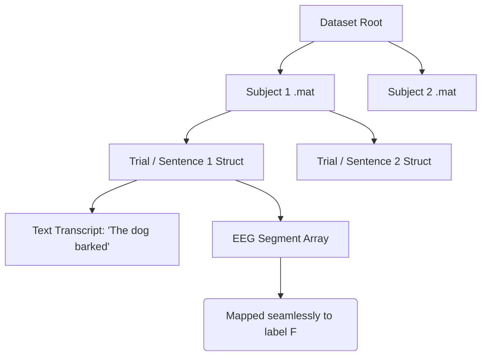

# EEG-to-Text and Speech Decoding Datasets

This document provides a comprehensive list of publicly available EEG datasets suitable for translating brain waves into text, mapping EEG to transcripts, and decoding speech.

## Dataset Summary Table

| Dataset             | Modality        | Paradigm         | Format                   | Link                                                                  |
| ------------------- | --------------- | ---------------- | ------------------------ | --------------------------------------------------------------------- |
| **ZuCo 1.0 & 2.0**  | Natural Reading | Text/Sentence    | `.mat` (Structs)         | [ZuCo 1.0](https://osf.io/q3zws/) / [ZuCo 2.0](https://osf.io/2urht/) |
| **JapanEEG**        | Overt Speech    | Continuous 1000h | BIDS (`.set` + `.tsv`)   | [ds007808](https://openneuro.org/datasets/ds007808)                   |
| **Moreira et al.**  | Auditory Speech | Phoneme/Word     | BIDS (`.set` + `.tsv`)   | [ds006104](https://openneuro.org/datasets/ds006104)                   |
| **Kara-One**        | Imagined Speech | Phoneme/Word     | `.mat` / `.npy` (Trials) | [Kara-One](http://individual.utoronto.ca/mrezazad/KaraOne/)           |
| **Simanova et al.** | Semantic Tasks  | Words/Pictures   | `.mat` (FieldTrip)       | [MPI Archive](https://hdl.handle.net/1839/00-0000-0000-0014-1C04-2)   |

---

## Data Structures and Mapping Paradigms (Graphs)

There are two primary ways these datasets map EEG signals to text transcripts.

### Paradigm A: Continuous EEG with Event Markers (BIDS Format)

Used by **JapanEEG** and **Moreira et al.**

```mermaid
gantt
    title BIDS Format: Mapping Continuous EEG to Transcripts
    dateFormat X
    axisFormat %s

    section EEG Stream
    Continuous Graph : active, 0, 10

    section events.tsv
    "apple" (Word Onset) : milestone, 2, 0
    "banana" (Word Onset) : milestone, 6, 0

    section Extracted Data
    Segment -> "apple" : 2, 4
    Segment -> "banana" : 6, 8
```

_(Continuous time-series files like `.edf` or `.set` are sliced using millisecond timestamps from a tabular `events.tsv` file containing the text transcripts)._

### Paradigm B: Pre-Segmented / Trial-Based Structs

Used by **ZuCo**, **Kara-One**, and **Simanova et al.**

_(The EEG time-series arrays are already sliced into discrete trials or sentences inside cell arrays or Python dictionaries. The textual label is directly attached to the struct containing the EEG segment)._

---

## Detailed Dataset Breakdown

### 1. ZuCo 1.0 & 2.0 (Zurich Cognitive Language Processing Corpus)

A dataset of simultaneous EEG and eye-tracking data recorded while participants read natural sentences.

- **Use Case:** Natural reading decoding, word-level and sentence-level text mapping.
- **Data Structure:** Provided as Matlab `.mat` files containing cell arrays of structs.
- **Transcript Mapping:** The continuous EEG data is precisely segmented by word boundaries using synchronized eye-tracking fixations.

### 2. JapanEEG (1000-hour Dataset)

A massive open-vocabulary dataset containing over 1000 hours of synchronized EEG, facial EMG, and audio data from overt Japanese speech production.

- **Use Case:** Representation learning, continuous speech decoding, and brain-computer interface (BCI) research.
- **Data Structure:** Follows BIDS standard (`.set`/`.edf` plus tabular `.tsv` event files).
- **Transcript Mapping:** The `events.tsv` file contains precise timestamp intervals for each spoken word, phoneme, or sentence, allowing you to slice the continuous EEG time-series graph.

### 3. Open-Access EEG Dataset for Speech Decoding (Moreira et al.)

Contains 64-channel EEG recordings from participants listening to speech sounds.

- **Use Case:** Phoneme discrimination, syllable classification, and auditory speech decoding.
- **Data Structure:** Standard BIDS format.
- **Transcript Mapping:** Event files mark the exact millisecond an auditory stimulus was presented, mapping specific brainwave segments to phoneme string labels.

### 4. Kara-One Dataset

Features EEG data collected while subjects performed imagined and vocalized phonemic and single-word prompts.

- **Use Case:** Imagined speech decoding, isolated word and phoneme translation.
- **Data Structure:** Distributed as Python-compatible `.npy` arrays or Matlab `.mat` files containing pre-segmented trial data.
- **Transcript Mapping:** Each trial represents a state machine. The EEG time-series arrays for the "imagined" and "vocalized" segments are mapped to one of 11 strict textual labels.

### 5. Simanova et al. EEG Language Dataset

Investigates semantic processing across various modalities.

- **Use Case:** Semantic decoding and modality-independent language representation.
- **Data Structure:** FieldTrip-compatible `.mat` structs.
- **Transcript Mapping:** Data is provided as pre-segmented epochs (trials) labeled with the specific textual word presented and its semantic category.

## Additional Repositories

- **OpenNeuro (https://openneuro.org):** A free and open platform for sharing MRI, MEG, EEG, iEEG, and ECoG data. Searching for "speech" or "language" yields many specific experiments.
- **NEMAR (https://nemar.org):** The Neuroelectromagnetic Data Archive and Tools Resource, useful for finding M/EEG data related to cognitive tasks.
